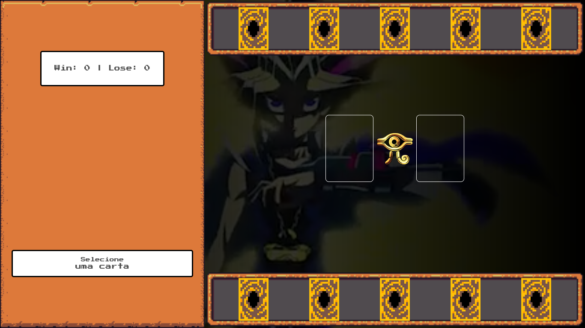
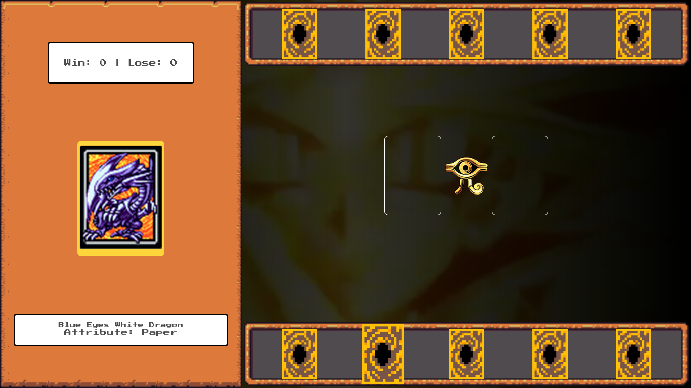
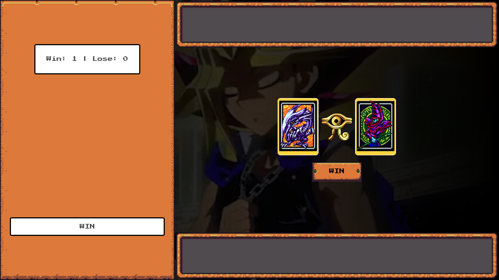

# :video_game: Pedra, papel e tesoura | Yu-Gi-Oh

Este projeto apresenta um jogo de cartas do Yu-Gi-Oh utilizando as mecânicas do conhecido Pedra, Papel e Tesoura. O jogador escolhe uma de suas cartas disponíveis e em sequência é apresentada a jogada do computador. Apresenta-se o resultado de acordo com as regras de jogo, podendo ser vitória (win), derrota (lose) ou empate (draw).

Utilizando JavaScript puro são abordados conceitos como organização de código, funções limpas, manipulação de DOM e armazenamento/gerenciamento de estado manual. Este é um desafio de projeto da Digital Innovation One.

## :gear: Tecnologias

- HTML
- CSS
- JavaScript

## :art: Layout

